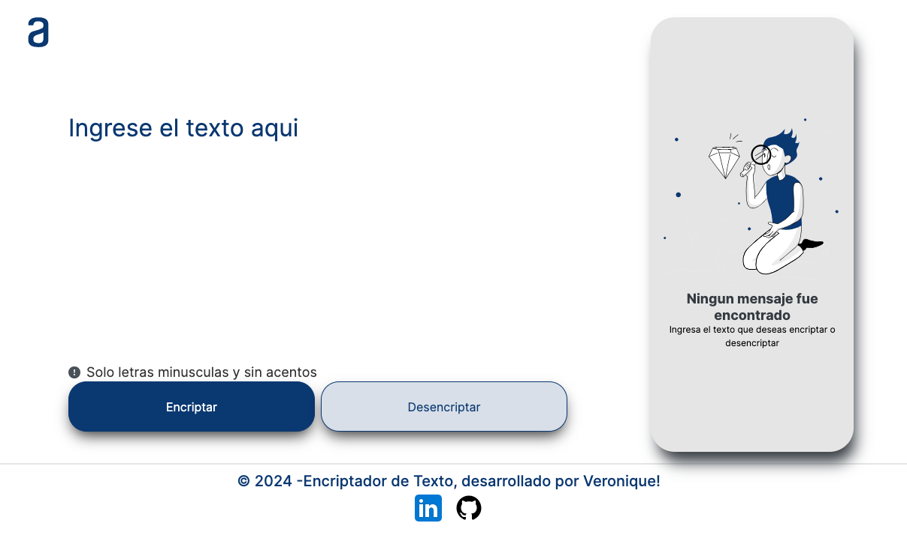
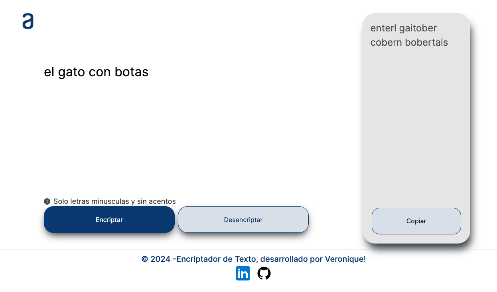
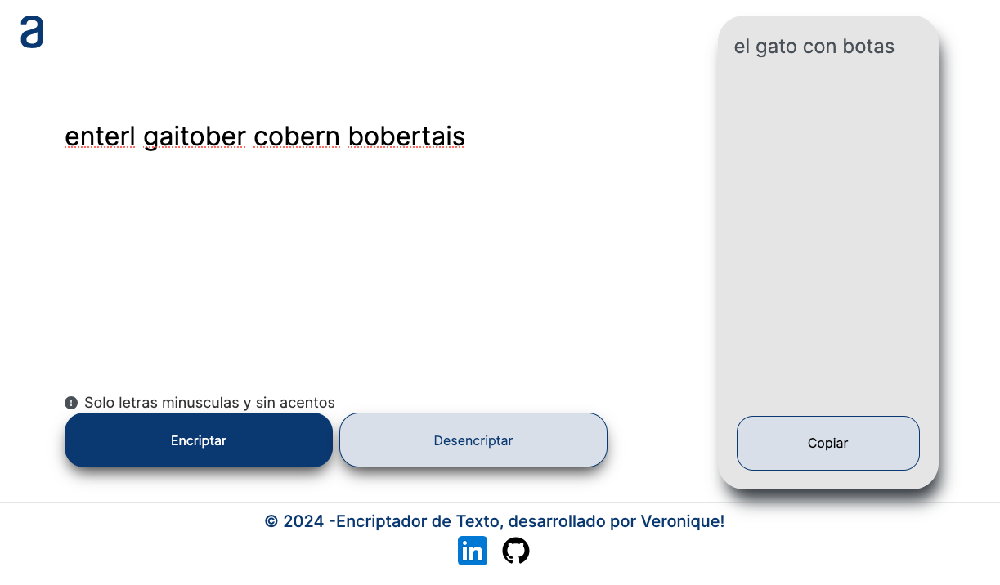

# Encriptador de Texto

Este proyecto es una aplicación web que permite encriptar y desencriptar mensajes de texto siguiendo un esquema específico. Además, incluye la funcionalidad de copiar el texto procesado al portapapeles. La aplicación es completamente responsive, adaptándose a diferentes tamaños de pantalla.

Este proyecto fue desarrollado como parte del curso de Introducción a la Programación de Alura para el programa Oracle One.



## Funcionalidades

- **Encriptar texto:** Convierte texto ingresado a un formato encriptado utilizando un esquema de reemplazo de caracteres.
- **Desencriptar texto:** Convierte texto encriptado de vuelta a su formato original.
- **Copiar texto:** Permite copiar el texto procesado al portapapeles con un solo clic.
- **Validaciones:** Asegura que el texto ingresado esté en minúsculas y no contenga caracteres especiales.

## Tecnologías Utilizadas

- HTML
- CSS
- JavaScript

## Uso

### Encriptar

1. Ingrese el texto en el área de texto.
2. Presione el botón "Encriptar".
3. El texto encriptado aparecerá en el área de resultado.



### Desencriptar

1. Ingrese el texto encriptado en el área de texto.
2. Presione el botón "Desencriptar".
3. El texto desencriptado aparecerá en el área de resultado.



### Copiar

1. Presione el botón "Copiar" para copiar el texto procesado al portapapeles.

## Validaciones

- El texto no debe estar vacío.
- El texto no debe contener caracteres especiales ni acentos.
- El texto debe estar en minúsculas.

## Cómo Ejecutar el Proyecto

1. Clona el repositorio desde GitHub:
   ```bash
   git clone https://github.com/veronicaisabelpereira/encriptador_de_texto.git.
2. Navega hasta el directorio del proyecto: ```bash cd encriptador_de_texto
3. Instala live-server globalmente si aún no lo tienes: ```bash npm install -g live-server
4. Ejecuta el proyecto en un servidor local utilizando live-server: ``bash live-server
5. Abre el navegador y accede a http://127.0.0.1:8080 (o la URL que live-server proporcione).
   

## Contacto

Para más información o preguntas, puedes contactarme a través de los siguientes enlaces:

- [LinkedIn](https://www.linkedin.com/in/veronica-isabel-pereira/)
- **Correo Electrónico:** veronicaisabelpereira80@gmail.com
